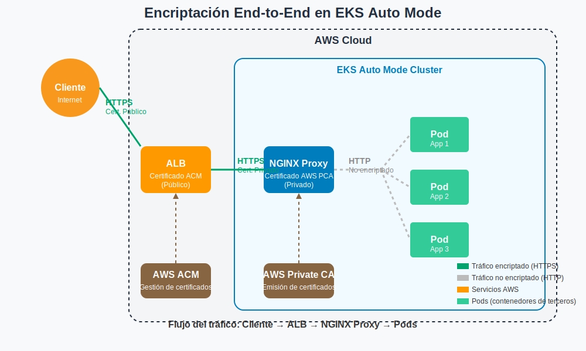

# Arquitectura de Encriptación End-to-End para Amazon EKS Auto Mode
#### *Una solución para encriptar tráfico ALB > Ingress > Pod con contenedores de terceros*

## Resumen Ejecutivo

Este documento presenta una arquitectura de referencia para implementar encriptación end-to-end en entornos Amazon EKS Auto Mode, abordando específicamente el desafío de trabajar con imágenes de contenedores de terceros que no pueden ser modificadas. La solución propuesta mantiene la seguridad en tránsito a lo largo de toda la ruta de comunicación, utilizando servicios nativos de AWS y respetando las limitaciones de EKS Auto Mode.

## Desafío Técnico

Las organizaciones que migran a Kubernetes frecuentemente enfrentan el reto de mantener encriptación end-to-end cuando:

1. Utilizan EKS Auto Mode donde AWS gestiona los componentes de infraestructura
2. Deben trabajar con imágenes de contenedores de terceros que no pueden modificarse
3. Necesitan cumplir con requisitos de seguridad y regulaciones que exigen encriptación en tránsito

Esta arquitectura resuelve estos desafíos proporcionando encriptación completa desde el cliente hasta las puertas del contenedor.

## Encriptación Nativa de AWS dentro del Clúster

Es importante destacar que AWS proporciona varias capas de encriptación por defecto para el tráfico dentro de EKS Auto Mode:

1. **Encriptación automática Nitro**: Las instancias basadas en el sistema AWS Nitro (que EKS Auto Mode utiliza) proporcionan encriptación automática del tráfico entre nodos que se ejecutan en el mismo tipo de instancia compatible dentro de una misma VPC o VPCs interconectadas por peering.

2. **Encriptación a nivel físico**: Todo el tráfico entre zonas de disponibilidad y regiones de AWS se encripta automáticamente a nivel físico antes de salir de las instalaciones seguras de AWS.

3. **Encriptación de volúmenes**: EKS Auto Mode configura automáticamente el almacenamiento efímero con políticas de encriptación apropiadas, como se indica en la documentación oficial de AWS.

---

## Arquitectura de la Solución



La arquitectura implementa una estrategia de encriptación en capas, aprovechando las capacidades nativas de AWS y añadiendo capas adicionales donde sea necesario:

### Componentes Clave

1. **Application Load Balancer (ALB)**: 
   - Gestionado automáticamente por EKS Auto Mode
   - Termina HTTPS desde el cliente usando certificados públicos de ACM
   - Reencripta el tráfico para la comunicación interna

2. **Proxy NGINX**:
   - Desplegado como un componente dedicado dentro del clúster
   - Recibe tráfico HTTPS desde el ALB
   - Actúa como punto final de terminación TLS antes de los pods
   - Utiliza certificados de AWS Private CA

3. **Pods de Aplicación**:
   - Contenedores de terceros sin modificar
   - Reciben tráfico HTTP desde el proxy NGINX dentro del perímetro seguro del clúster
   - Se benefician de la encriptación automática Nitro entre nodos del clúster

4. **Servicios de Gestión de Certificados**:
   - AWS Certificate Manager (ACM) para certificados públicos
   - AWS Private Certificate Authority (PCA) para certificados privados internos

### Flujo de Tráfico y Encriptación

1. **Cliente a ALB**:
   - Protocolo: HTTPS (TLS 1.2/1.3)
   - Certificado: Público (AWS Certificate Manager)
   - Encriptación: TLS con certificados públicos confiables

2. **ALB a Proxy NGINX**:
   - Protocolo: HTTPS (TLS 1.2/1.3)
   - Certificado: Privado (AWS Private CA)
   - Encriptación: TLS con certificados privados internos
   - *Beneficio adicional*: Encriptación automática Nitro a nivel de infraestructura para instancias compatibles

3. **Proxy NGINX a Pods**:
   - Protocolo: HTTP
   - Seguridad: Tráfico confinado dentro del perímetro seguro del clúster
   - Network Policies de Kubernetes que restringen el acceso
   - *Beneficio adicional*: Encriptación automática Nitro entre nodos cuando utilizan tipos de instancias compatibles

---

## Ventajas de la Arquitectura

- **Cumplimiento**: Mantiene encriptación en tránsito para cumplir con requisitos regulatorios
- **Compatibilidad**: Funciona con imágenes de contenedores de terceros sin modificaciones
- **Servicios Nativos**: Aprovecha servicios AWS (EKS Auto Mode, ACM, Private CA)
- **Simplicidad Operativa**: Elimina la necesidad de gestionar certificados manualmente
- **Seguridad en Capas**: Implementa seguridad a nivel de red, transporte y aplicación
- **Encriptación Nitro automática**: Aprovecha la encriptación integrada del sistema AWS Nitro

---

## Implementación de Referencia

### Prerrequisitos 

- Cuenta AWS con permisos para EKS, ACM, Private CA e IAM
- Nombre de dominio registrado para la configuración de DNS
- AWS CLI, kubectl y eksctl configurados

### Paso 1: Creación del Clúster EKS Auto Mode

```bash
export CLUSTER_NAME="eks-automode-secure"
export AWS_REGION="us-east-1"

cat <<EOF > cluster-config.yaml
apiVersion: eksctl.io/v1alpha5
kind: ClusterConfig
metadata:
  name: ${CLUSTER_NAME}
  region: ${AWS_REGION}
  version: "1.28"
autoMode:
  enabled: true
iam:
  withOIDC: true
vpc:
  clusterEndpoints:
    privateAccess: true
    publicAccess: true
EOF

eksctl create cluster -f cluster-config.yaml
```

### Paso 2: Configuración de AWS Certificate Manager

```bash
# Solicitar certificado público para ALB
export APP_DOMAIN="app.example.com"

aws acm request-certificate \
  --domain-name ${APP_DOMAIN} \
  --validation-method DNS \
  --region ${AWS_REGION}

# Guardar ARN del certificado
export PUBLIC_CERT_ARN=$(aws acm list-certificates \
  --query "CertificateSummaryList[?DomainName=='${APP_DOMAIN}'].CertificateArn" \
  --output text)
```

### Paso 3: Configuración de AWS Private CA

```bash
# Crear CA privada
aws acm-pca create-certificate-authority \
  --certificate-authority-configuration file://ca-config.json \
  --certificate-authority-type "ROOT" \
  --tags Key=Environment,Value=Production

# Solicitar certificado privado para comunicación interna
export INTERNAL_DOMAIN="*.internal.example.com"

aws acm request-certificate \
  --certificate-authority-arn ${CA_ARN} \
  --domain-name ${INTERNAL_DOMAIN} \
  --region ${AWS_REGION}

export PRIVATE_CERT_ARN=$(aws acm list-certificates \
  --query "CertificateSummaryList[?DomainName=='${INTERNAL_DOMAIN}'].CertificateArn" \
  --output text)
```

### Paso 4: Implementación del Proxy NGINX

```bash
# ConfigMap para NGINX
cat <<EOF > nginx-config.yaml
apiVersion: v1
kind: ConfigMap
metadata:
  name: nginx-config
  namespace: app-namespace
data:
  default.conf: |
    server {
        listen 443 ssl;
        server_name _;
        
        ssl_certificate /etc/nginx/certs/tls.crt;
        ssl_certificate_key /etc/nginx/certs/tls.key;
        ssl_protocols TLSv1.2 TLSv1.3;
        
        location / {
            proxy_pass http://app-backend-service:80;
            proxy_set_header Host $host;
            proxy_set_header X-Real-IP $remote_addr;
        }
    }
EOF

# Deployment del Proxy
cat <<EOF > nginx-proxy.yaml
apiVersion: apps/v1
kind: Deployment
metadata:
  name: nginx-proxy
  namespace: app-namespace
spec:
  replicas: 2
  selector:
    matchLabels:
      app: nginx-proxy
  template:
    metadata:
      labels:
        app: nginx-proxy
    spec:
      containers:
      - name: nginx
        image: nginx:1.25
        ports:
        - containerPort: 443
        volumeMounts:
        - name: nginx-config
          mountPath: /etc/nginx/conf.d
        - name: nginx-certs
          mountPath: /etc/nginx/certs
      volumes:
      - name: nginx-config
        configMap:
          name: nginx-config
      - name: nginx-certs
        secret:
          secretName: nginx-tls
EOF
```

### Paso 5: Configuración del Ingress y ALB

```bash
cat <<EOF > alb-ingress.yaml
apiVersion: networking.k8s.io/v1
kind: Ingress
metadata:
  name: app-ingress
  namespace: app-namespace
  annotations:
    kubernetes.io/ingress.class: alb
    alb.ingress.kubernetes.io/scheme: internet-facing
    alb.ingress.kubernetes.io/certificate-arn: ${PUBLIC_CERT_ARN}
    alb.ingress.kubernetes.io/listen-ports: '[{"HTTPS":443}]'
    alb.ingress.kubernetes.io/backend-protocol: HTTPS
    alb.ingress.kubernetes.io/target-type: ip
spec:
  rules:
  - host: ${APP_DOMAIN}
    http:
      paths:
      - path: /
        pathType: Prefix
        backend:
          service:
            name: nginx-proxy-service
            port:
              number: 443
EOF
```

---

## Consideraciones de Seguridad

### Seguridad de Red

1. **Network Policies**: Implementar políticas para restringir el tráfico entre pods:

```yaml
apiVersion: networking.k8s.io/v1
kind: NetworkPolicy
metadata:
  name: restrict-backend-access
  namespace: app-namespace
spec:
  podSelector:
    matchLabels:
      app: app-backend
  policyTypes:
  - Ingress
  ingress:
  - from:
    - podSelector:
        matchLabels:
          app: nginx-proxy
    ports:
    - protocol: TCP
      port: 80
```

2. **Segmentación de Subred**: Aprovechar las subredes públicas y privadas de EKS Auto Mode.

3. **Encriptación Nitro**: Verificar que se utilizan tipos de instancias compatibles con la encriptación automática de Nitro:
   - C5n, G4, I3en, M5dn, M5n, M5zn, M6a, M6i, M6id, M6idn, M6in, M7a, M7g, M7gd, M7i, M7i-flex, M8g, M8gd, P3dn, R5dn, R5n y otros tipos compatibles con Nitro.

### Gestión de Certificados

1. **Rotación Automática**: Configurar renovación automática de certificados
2. **Monitoreo**: Alertas para certificados próximos a expirar
3. **Auditoria**: Activar registros de AWS Private CA

### Hardening de NGINX

1. **Configuración de Ciphers**: Usar solo cifrados fuertes
2. **Updates**: Mantener la imagen de NGINX actualizada
3. **Minimización**: Usar imágenes base reducidas (Alpine)

---

## Monitoreo y Operación

### Métricas Clave

- Tasa de éxito de handshakes TLS
- Latencia de establecimiento de conexión
- Caducidad de certificados
- Tasa de errores SSL/TLS

### Configuración de Alarmas

```bash
# Ejemplo de CloudWatch Alarm para certificados próximos a expirar
aws cloudwatch put-metric-alarm \
  --alarm-name CertificateExpiration \
  --alarm-description "Alert when certificates are 30 days from expiry" \
  --metric-name DaysToExpiry \
  --namespace AWS/CertificateManager \
  --statistic Minimum \
  --period 86400 \
  --threshold 30 \
  --comparison-operator LessThanThreshold \
  --dimensions Name=CertificateArn,Value=${PUBLIC_CERT_ARN}
```

---

## Pruebas de Verificación

Para validar la implementación, se recomiendan las siguientes pruebas:

### 1. Verificación de Encriptación Cliente-ALB

```bash
# Verificar certificado público
openssl s_client -connect app.example.com:443 -servername app.example.com
```

### 2. Verificación de Encriptación ALB-NGINX

```bash
# Crear pod de prueba
kubectl run test-curl --image=curlimages/curl --rm -it -- sh

# Desde el pod, verificar
curl -v --insecure https://nginx-proxy-service.app-namespace.svc.cluster.local:443
```

### 3. Prueba de Penetración

- Intentar conexiones no TLS al ALB
- Verificar rechazos de conexión debido a certificados inválidos
- Verificar que las Network Policies bloquean accesos no autorizados

---

## Conclusión

Esta arquitectura de referencia proporciona una solución completa para implementar encriptación end-to-end en entornos Amazon EKS Auto Mode, cumpliendo con requisitos de seguridad estrictos incluso cuando se trabaja con imágenes de contenedores de terceros que no pueden modificarse.

Al implementar esta solución, las organizaciones pueden:

- Cumplir con requisitos regulatorios de encriptación en tránsito
- Minimizar la superficie de ataque al mantener el tráfico encriptado
- Aprovechar servicios nativos de AWS para simplificar la operación
- Integrar de forma segura aplicaciones de terceros en sus arquitecturas cloud
- Beneficiarse de la encriptación automática que proporciona la infraestructura AWS Nitro

---

## Referencias

1. [Documentación de Amazon EKS Auto Mode](https://docs.aws.amazon.com/eks/latest/userguide/automode.html)
2. [Mejores prácticas de seguridad de AWS para EKS](https://aws.github.io/aws-eks-best-practices/security/docs/)
3. [AWS Certificate Manager User Guide](https://docs.aws.amazon.com/acm/latest/userguide/acm-overview.html)
4. [AWS Private Certificate Authority](https://docs.aws.amazon.com/privateca/latest/userguide/PcaWelcome.html)
5. [Guía de Network Policies de Kubernetes](https://kubernetes.io/docs/concepts/services-networking/network-policies/)
6. [Encriptación en tránsito en Amazon EC2 (AWS Nitro System)](https://docs.aws.amazon.com/AWSEC2/latest/UserGuide/data-protection.html)
7. [Consideraciones de seguridad para Amazon EKS Auto Mode](https://docs.aws.amazon.com/eks/latest/userguide/auto-security.html)

---

*Este documento es una arquitectura de referencia y puede requerir ajustes según los requisitos específicos de cada organización.*

© 2025 - Arquitectura de Encriptación End-to-End para Amazon EKS Auto Mode
